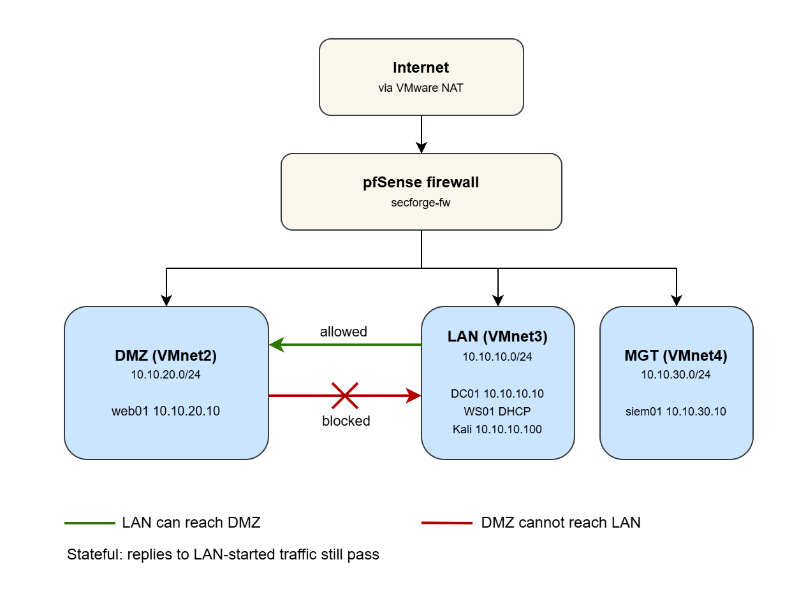

Hello, I'm Artur — a penetration tester and infosec specialist at ONESEC in Tashkent, Uzbekistan, with a bit over two years in the field and a BSc in Computer Science and Engineering from Inha University (2026). Security has been attracting me for a long time. This is the field that's both impossibly broad and endlessly deep, and this blog is where I start writing my way through it. 

This post begins a series built around a project I invented, **SecForge Industries** — a fictional fintech company with a public web app, an AI customer-service chatbot, an internal Active Directory network, and a documented compliance posture mapped to SOC 2 and ISO 27001. Across the series I attack it, defend it, and document every finding twice: once as a technical vulnerability, and also as a compliance gap. This sound cool to me and not many people doing it. Each post is a complete case study — vulnerability, exploit, business impact, control violation, and remediation.

## The short version

Most networks are one open huge room. I split mine into three separate rooms with a firewall between them, then added a rule that says the internet-facing room can talk _out_ but can never talk _in_ to the trusted room. If that web server ever gets hacked, the attacker is stuck. That restraint is called network segmentation.

## Why split a network at all?

Most home and small-office networks are flat. Your laptop, your phone, the smart TV, and that one web server you set up couple of years ago that are all sit in the same space, free to talk to each other. It's very convenient. It's also how one hacked device becomes ten.

Picture an office where every internal door is propped open. A visitor who talks their way into the lobby can walk straight into the server room, sit down at the accounting desk, and open the CEO's laptop. Nobody prevents them from doing so, as there's nothing to stop them with.

Segmentation is the unglamorous fix. You put up internal walls and locked doors, so getting into the lobby no longer means getting into everything. So here's the key insight: the lobby is the part of your network that faces the internet. That's where attacks happen first. That's exactly where the walls need to be strongest and thickest.

## The setup: three zones and one guard

I divided the lab into three zones, each on its own separate network.

**The trusted zone (LAN).** This is the inside of the building. My domain controller lives here, which is the machine that holds all the user accounts and passwords for the lab, plus a Windows workstation and my attacker machine. These are the systems I care about protecting.

**The DMZ.** DMZ stands for "Demilitarized Zone." The name is borrowed from the buffer strip between two opposing armies, which is a dramatic label for what is really just a network lobby. It's where you put machines that strangers on the internet are allowed to reach, like a public website. The deal is simple: people can come into the lobby, but the door from the lobby into the offices stays locked. My web server lives here.

**The management zone.** A separate, quiet zone for the security monitoring server I'll build later. It watches; it doesn't get touched by the other two.

Sitting in the middle is a firewall, a piece of software called pfSense in my case, and every packet has to pass through it to get from one zone to another. You can think of it as a guard posted at each door, holding a rulebook and checking everyone who tries to pass.


_Figure 1. The whole lab in one picture. 3 separate zones, 1 firewall between them, and the internet reachable only through that firewall._

## Picking how the machines connect

Since the entire lab runs as virtual machines on one laptop, I had to choose how those machines connect to a network. VMware gives three options, and the choice matters more than it looks.

**Bridged.** The virtual machine plugs straight into your real home network and gets a real address, visible to your router and every device in the house. Fine for ordinary use. A bad idea for a lab where you plan to run attacks and, later, actual malware. 

**NAT.** The machine shares your computer's internet connection through a hidden private network. It can call out to the internet, but nothing on the internet can call in to it directly.

**Host-only.** The machine sits on a private virtual network that connects to nothing at all, unless you deliberately wire it up. A sealed room.

I built each zone as a host-only network, so by default the rooms are sealed off from each other and from the world. Then I gave the firewall a single controlled line to the internet through VMware's NAT, which acts as a stand-in for the real internet. The only way out of any room is through the guard.

## The rule that does all the work

With the zones built, the real security lives in the firewall's rulebook. Two things about how it reads that book matter. It reads the rules from the top to bottom, and the first rule that matches a packet wins. And by default, its attitude toward the DMZ is "I don't know you, get out." Everything is blocked until you write a rule that allows it. That default is exactly the behavior you want.

For the DMZ we need three rules. In plain English:

1. Block anything from the DMZ trying to reach the trusted LAN.
2. Block anything from the DMZ trying to reach the management zone.
3. Allow the DMZ to reach the internet for everything else.

Rule 1 is the entire point of this post. It's one line. It says the lobby cannot open the door into the offices. Everything else in this lab is built on top of that single line holding.


_Figure 2. The DMZ rulebook. The top "Block DMZ to LAN" rule is the security control. The rest is housekeeping._

## Build it yourself

Here are the networking pieces that actually create the segmentation, so you can
reproduce the result. The OS installs, the Active Directory setup, and the
intentional misconfigurations are the next post — this is only the wiring that
makes the wall. (Interface names like `ens32` and `Ethernet0` are mine; check yours.)

**The zones (VMware).** Each zone is a separate host-only network with VMware's own
DHCP turned off, because pfSense is the DHCP server:

- VMnet2 = DMZ, 10.10.20.0/24
- VMnet3 = LAN, 10.10.10.0/24
- VMnet4 = Management, 10.10.30.0/24

pfSense gets one interface in each, plus a WAN interface on VMware's NAT for internet.

**web01 (the DMZ web server).** It needs a fixed address so the rules and the tests
always point at the same place. On Ubuntu that lives in netplan:

```c
/etc/netplan/00-installer-config.yaml:

network:
  version: 2
  ethernets:
    ens32:
      addresses:
        - 10.10.20.10/24
      routes:
        - to: default
          via: 10.10.20.1     # the pfSense DMZ interface
      nameservers:
        addresses:
          - 1.1.1.1
```

Apply and confirm:

```c
sudo netplan apply
ip a            # ens32 should show 10.10.20.10/24
ip route        # default via 10.10.20.1
```
​
**DC01 (a machine in the trusted LAN).** Static address on the LAN, from an elevated
PowerShell:

```c
New-NetIPAddress -InterfaceAlias "Ethernet0" -IPAddress 10.10.10.10 -PrefixLength 24 -DefaultGateway 10.10.10.1
```

the DC is its own DNS server, so it points at itself (more on that in the AD post)

```c
Set-DnsClientServerAddress -InterfaceAlias "Ethernet0" -ServerAddresses 127.0.0.1
Get-NetIPAddress -AddressFamily IPv4
```
​
Kali (the attacker, in the LAN). No static config; it takes a DHCP lease from pfSense in 10.10.10.0/24. Just confirm where it landed:

```c
ip a            # an address in 10.10.10.0/24
```

The firewall rules on the DMZ interface, read top to bottom, first match wins:

1. Block — source DMZ net, destination LAN net (logged)
2. Block — source DMZ net, destination management net (logged)
3. Pass — source DMZ net, destination any

The LAN interface keeps pfSense's default "allow LAN to any," which is what lets
Kali reach the DMZ.
## "Hold on, this looks broken"

Here is where I confused myself, and where a real concept is hiding.

After applying the rules, I logged into the web server to test them. It reached the internet fine. It could not ping the domain controller on the LAN. And for about a minute I was sure I'd misconfigured something, because surely if I block the DMZ from reaching the LAN, then traffic flowing the _other_ way should break too, right? How would the web server ever answer my attacker machine?

It works, and the reason is that pfSense is a **stateful** firewall. "Stateful" means it remembers conversations it has already allowed. When a machine on my trusted LAN starts a conversation with the web server, the firewall makes a note of it and lets the web server reply to that specific conversation. But the web server still cannot _start_ its own conversation into the LAN.

The everyday version: you can call a company's support line, and the operator can talk back to you on that call. That does not give them permission to cold-call your phone at two in the morning whenever they feel like it. Replies to a call you started are fine. Unsolicited calls into your network are blocked. Same idea.

So I sat there watching the firewall do its job perfectly and calling it broken. The firewall was fine. I just got confused at first. 

## Proving it works

A security control you can't demonstrate is just a hopeful comment in a config file. So here is the proof, in both directions.

From Kali (LAN): ​

```c
ping -c3 10.10.20.10 # web01 in the DMZ -> replies ssh secforge@10.10.20.10 # logs straight into web01 ​
```

From web01 (DMZ): 

```c
ping -c3 1.1.1.1 # internet -> replies sudo apt update # internet -> works ping -c3 10.10.10.10 # the DC on the LAN -> 100% loss, blocked 
```

From a machine on the trusted LAN, I can reach the web server in the DMZ. The ping replies, and SSH gives me a login prompt. Trusted reaching exposed: allowed.


_Figure 3. From the trusted zone, I can reach the web server in the DMZ. This is allowed on purpose._

From the web server in the DMZ, I can reach the internet. A ping to 1.1.1.1 succeeds and software updates download. But a ping to the domain controller on the LAN just times out. Exposed reaching the internet: allowed. Exposed reaching trusted: blocked.


 _Figure 4. From the DMZ, the internet is reachable but the trusted LAN is not. The timeout is the wall holding._

And because I turned on logging for that block rule in pfSense, the firewall records every attempt the DMZ makes to reach the LAN. If the web server is ever compromised and starts probing inward, I will see it.


_Figure 5. The firewall log. Every blocked attempt from the DMZ to the LAN is recorded here._

That asymmetry, where trusted can reach exposed but exposed cannot reach trusted, is the whole idea of a DMZ working in front of you.

## Why this matters outside a lab

This isn't just a hobby preference. Two of the most widely used security frameworks ask for exactly this.

**NIST SP 800-53, control SC-7, "Boundary Protection."** In plain terms: watch and control traffic at the edges of your system, including the important internal edges, not only the outer wall facing the internet. Segmenting your zones is how you handle those internal edges.

**ISO/IEC 27001:2022, Annex A control 8.22, "Segregation of networks."** (This was numbered A.13.1.3 in the older 2013 version of the standard, in case you see the old reference.) In plain terms: keep groups of systems on separate networks based on how much you trust them, so a problem in one group does not spread to the others.

So when an auditor asks how you stop a breach of a public-facing server from spreading to the rest of the network, the honest answer is a diagram of these zones and a screenshot of that one block rule. In fact, a common audit test is to try pinging a sensitive server from an untrusted machine. If it replies, you fail. The demonstration above is the exact that test, and the DMZ failed to reach the LAN, which is the result you want.

## What segmentation does not do

One control is never the whole answer, so here are the honest limits: 
- It does not protect machines in the *same* zone from each other. The firewall between zones never sees traffic that stays inside one zone. 
- It does not patch anything. A vulnerable server in the DMZ is still vulnerable; segmentation only limits where a successful attacker can go next. 
- The DMZ still reaches the internet, which is its own risk (data theft, command-and-control). Tightening that is a later refinement. 
- It buys containment, not immunity. The monitoring server I'll build later exists precisely because walls can be climbed.

## What's next

This lab is the foundation, and now that the walls are up, the next parts are gonna be the interesting ones. I'll stand up a deliberately vulnerable web application in the DMZ and attack it. Then I'll do the same with an AI chatbot and try to make it misbehave. Finally I'll wire up the monitoring server in the management zone to watch all of it and catch the attacks. Each of those gets its own post.

The order is not an accident. The walls come first. You secure the building before you decide where to put the guards.

## Takeaways

- Network segmentation means splitting one network into separate zones and controlling the traffic between them.
- Put internet-facing machines in a DMZ, a network lobby, so that a breach there is contained instead of spreading.
- A stateful firewall lets replies through for conversations the trusted side started, while still blocking the exposed side from starting its own conversations inward.
- The control is only real if you can demonstrate it. Trusted should reach exposed; exposed should not reach back.
- This maps directly to NIST SC-7 (Boundary Protection) and ISO 27001:2022 control 8.22 (Segregation of networks).

## Gotchas

* Sometimes I did not understand why I can not ping web01 from my kali. This was most likely a stale ARP entry and/or a stale firewall state tied to Kali's old `.100` address. When Kali's DHCP lease changed to `.102`, the network briefly held cached mappings pointing at the old IP — pfSense and web01 still "remembered" `.100`. Luckily those cached entries don't live forever as they have timeouts. After a few minutes they aged out (or got re-resolved on the next attempt), and the path re-established itself. Time fixed it. That's the classic signature of "I changed nothing, waited, and it healed": something cached expired.
* pfSense filters on the inbound interface, first match wins — a rule on the wrong interface, or below a broader rule, silently does nothing. Interface and order matter.
* Rule changes hit new connections instantly, but old ones keep going. After clicking Apply, I expected the change to affect everything at once. It doesn't. Existing connections keep their old decision until that state expires, which is why a change can look delayed. Diagnostics > States > Reset States forces it through immediately.

